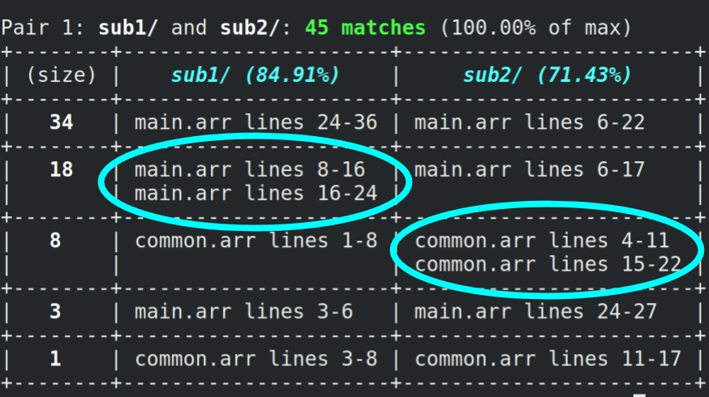

# Pyret Moss
Pyret Moss is a command line application for determining the similarity of programs written in [Pyret](https://www.pyret.org/). It was inspired by the ["Measure of Software Similarity"](https://theory.stanford.edu/~aiken/moss/) system developed at Stanford, and its core ideas can be found in [this paper](http://theory.stanford.edu/~aiken/publications/papers/sigmod03.pdf).

Please note that while the primary intended use case for this program is to help detect plagiarism across homework assignment submissions written in Pyret, **proof of plagiarism may not be guaranteed solely from the similarity scores returned in the output**. Instructors should manually check pairs of submissions with high similarity scores before determining the presence of plagiarism. The responsibility of Moss is to present the **relative similarity** between pairs of submissions, leaving the decision of what constitutes plagiarism to the instructor. More information about understanding output can be found in the corresponding section below.

## How to Build and Run
### Building for Development
If you'd like to work on `pyret-moss` for yourself, you can clone this repository and compile/run using `cargo run` from the root directory of the project. Command-line arguments can be passed after a `--` (so they won't be passed to cargo itself), e.g. `cargo run -- --help`.

You can run the test suite with `cargo test`.

### Building for Production
To build the project for use in a production setting, run `cargo build --release`. You can now run the compiled binary using `./target/release/pyret-moss` from the project directory.

#### Execute Anywhere
If you'd like to be able to access the Pyret Moss executable from anywhere on your system, you can copy it into `/usr/local/bin` by running
```
sudo cp ./target/release/pyret-moss /usr/local/bin
```
from the project root. Restart your terminal and you should now be able to execute the application by typing just `pyret-moss`.

### Running
Usage of the application is as follows:
```
pyret-moss <submissions-dir> [options]
```
where `<submissions-dir>` is a directory containing each submission (subdirectory), and the following optional arguments can take the place of `[options]`:

```
-h, --help                              Prints this help information
-s, --single-file-mode                  Submissions are assumed to be single .arr files
-k, --noise <VALUE>                     Sets the noise threshold
-t, --guarantee <VALUE>                 Sets the guarantee threshold
    --ignore-content <DIR>              Ignore portions of submissions that match any file's content in DIR
    --ignore-files "<FILE>[ <FILE>]"    Ignore submission files with the given names
    --match-threshold <VALUE>           Only report submission pairs with pair percentile at least VALUE (0-100)
-o, --output <FILE>                     Write analysis to FILE instead of stdout
-v, --verbose                           More logging
-p, --no-pauses                         Don't pause for confirmation to continue when rendering results
```

For example, `pyret-moss ./subs -s -k 5 -t 15 -o ~/Desktop/out.txt -v` will expect the individual .arr files in `./subs` to each represent a submission, will run with noise threshold 5 and guarantee threshold 15, will write the output to `~/Desktop/out.txt`, and will use verbose logging during execution.

**Ignore content:** The `--ignore-content` directory should contain .arr files, the content of which is expected to appear often among submissions, but shouldn't contribute to overlap (i.e. boilerplate code given to everyone).

**Ignore files:** Files in student submissions that match any of the filenames given to `--ignore-files` will not be included in the analysis at all. For example, if the application is run with `--ignore-files "tests.arr common.arr"`, then any files named `tests.arr` or `common.arr` within submissions will be excluded. 

See below sections for more on the noise/guarantee thresholds, match percentage, and output. If no flags are given, the program will run with the following **default configuration**:

- Noise threshold: 15 characters
- Guarantee threshold: 20 characters
- Match threshold: 0% (all pairs shown)
- Submissions are assumed to be *subdirectories of .arr files*

## Determining Similarity
The process consists of four main components.

### Normalization
As the submissions in the input directory are being read, all .arr files within each submission are first normalized to ignore features from the program text which should not differentiate it from other programs. From each original file, a normalized text is generated such that:

1. Identifiers are normalized (all the same)
2. Type annotations are removed
3. Whitespace is removed
4. Docstrings are removed
5. Comments are removed

During this process, a mapping from characters in the normalized text to the line on which they occurred is preserved, so fingerprints can be later traced to lines in the original files.

### Fingerprinting
Each normalized text is then fingerprinted, which involves determining a set of hashed substrings (fingerprints) which represent that particular text. Given a normalized text and values for the noise threshold (k) and guarantee threshold (t):

1. The text is converted into a sequence of "k-grams", or contiguous substrings of length k
2. Each k-gram is converted into an integer using a rolling hash function
3. Windows of hashes of length t - k + 1 are generated
4. The robust winnowing algorithm is used to select a set of hashes from the set of windows, and these hashes are the text's fingerprints

So what are the noise/guarantee thresholds?
- *Noise threshold (k)*: substring matches across normalized texts shorter than k characters are not considered.
- *Guarantee threshold (t)*: substring matches across normalized texts of length t characters or greater are guaranteed to be caught.

Both k and t must be positive, and 0 < k <= t.

### Matchmaking
Once all submissions have been fingerprinted, those with shared fingerprints are paired together. If a pair of submissions has a pair "percentile" greater than the "match threshold" argument (default 0%), it will be included in the output. Note that a pair's "percentile" is calculated as the quotient of its number of shared hashes and the maximum number of shared hashes between any two submissions.

### Pair Analysis
Once submissions have been paired and the pairs ordered by number of matches, the overlap must be presented to the user effectively. To accomplish this, shared substrings of fingerprints are analyzed, and such substrings are rendered as rows in a given submission pair table in the output.

The goal of this phase is to present long matches between submissions to the user as just that: long matches, as opposed to a series of smaller, disjointed segments. The substrings of shared fingerprints that appear in a pair table are chosen such that the following property holds:

> If a fingerprint is shared, then one of the longest common substrings of hashes that *includes that fingerprint* appears as a match in the output. 

This attempts to render fingerprints within the largest matching context in which they occur.

## Understanding Output
The program produces a series of tables as output. Each table represents a *pair* of submissions that share significant overlap, and pairs are ordered by their amount of overlap.

### Pair Tables


- **Total number of shared fingerprints** is the number of distinct hashes of fingerprints that were shared between submissions.
- **Pair "percentile"** indicates what percentage the total shared fingerprints for this pair comprises of the max total shared fingerprints across all submission pairs. 
    - used to limit the output through the `--match-threshold` parameter.
- **Content match percentages** indicates what percentage of a given submission's fingerprints are shared with the other submission.
    - in this example, 75% of `sub1/`'s fingerprints also appear in `sub3/`, but only 28% of `sub3/`'s fingerprints appear in `sub1/`.
- Each row in a table represents a *substring* of fingerprints shared between the two submissions.
    - the length of this substring is indicated in the `(size)` column
    - rows are sorted by substring length, as long substrings indicate sections of each submission that share significant overlap

### Internal Repetition


If there is significant internal repetition within a submission, then several disparate sections of files may share a given substring of fingerprints. In such cases, multiple sections of files may be listed within a given row (pictured above).

This means every section listed within the left cell matches the same fingerprint substring that every section within the right cell matches, and vice versa.
